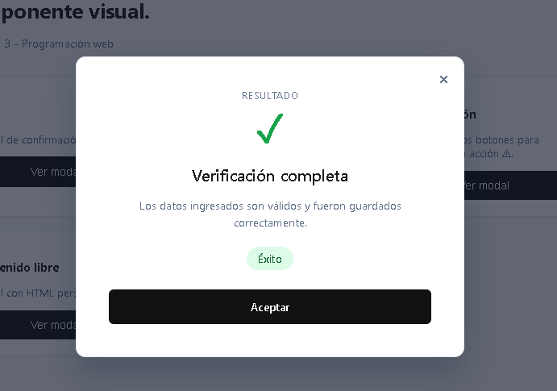
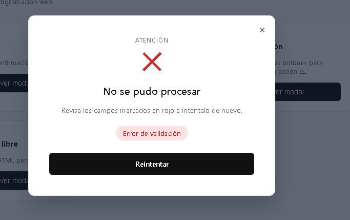
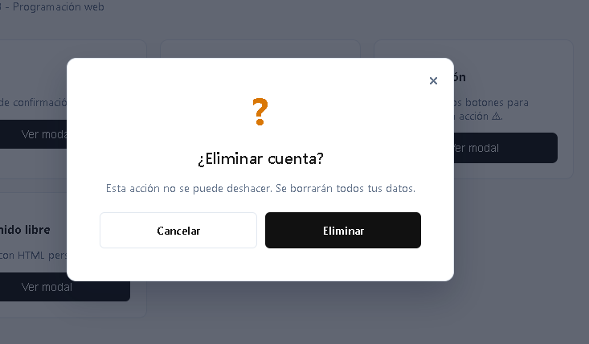

# 🪟 DSX Modal

Componente visual reutilizable de **ventana modal**, escrito en JavaScript puro (sin frameworks), pensado para mostrar resultados, confirmaciones, formularios o mensajes de estado dentro de cualquier página HTML.

> Repositorio: `<PEGA_AQUÍ_EL_LINK_DEL_REPO>`
> Demo en vivo (GitHub Pages): `<PEGA_AQUÍ_EL_LINK_DE_PAGES>`

---

## 📌 ¿Qué problema resuelve?

Casi cualquier proyecto necesita, en algún momento, mostrar una ventana emergente: un mensaje de éxito, un error, una confirmación antes de borrar algo, o un mini-formulario. Normalmente esto se vuelve a programar desde cero en cada proyecto (HTML fijo en el `index.html`, CSS repetido, JS pegado a un solo caso de uso).

**DSX Modal** resuelve esto ofreciendo un modal 100% reutilizable:

- Se controla completamente desde JavaScript, con una sola llamada.
- Acepta contenido distinto cada vez (texto, badges, íconos, HTML libre, botones dinámicos).
- No necesita que el HTML del modal ya exista en la página: se genera en tiempo real.
- Es responsivo, accesible (cierra con `ESC`, respeta `prefers-reduced-motion`) y no depende de ninguna librería externa.

---

## Instalación

Copia las carpetas `css/` y `js/` dentro de tu proyecto y enlázalas en tu HTML:

```html
<head>
  <link rel="stylesheet" href="css/componente.css">
</head>
<body>

  <!-- tu contenido -->

  <script src="js/componente.js"></script>
</body>
```


---

## Uso

### Modal básico de éxito

```javascript
DSXModal.show({
  tipo: 'exito',
  icono: '✓',
  etiqueta: 'Resultado',
  titulo: 'Verificación completa',
  mensaje: 'Los datos ingresados son válidos y fueron guardados correctamente.',
  badge: { texto: 'Mayor de edad', tipo: 'exito' },
  botones: [
    { texto: 'Aceptar', tipo: 'primario', onClick: (modal) => modal.cerrar() }
  ]
});
```

### Modal de error

```javascript
DSXModal.show({
  tipo: 'error',
  icono: '✕',
  titulo: 'No se pudo procesar',
  mensaje: 'Revisa los campos marcados en rojo e inténtalo de nuevo.',
  badge: { texto: 'Error de validación', tipo: 'error' }
});
```

### Modal de confirmación (dos botones)

```javascript
DSXModal.show({
  tipo: 'advertencia',
  icono: '?',
  titulo: '¿Eliminar cuenta?',
  mensaje: 'Esta acción no se puede deshacer.',
  botones: [
    { texto: 'Cancelar', tipo: 'secundario', onClick: (m) => m.cerrar() },
    { texto: 'Eliminar', tipo: 'primario', onClick: (m) => {
        // lógica de borrado aquí
        m.cerrar();
      }
    }
  ]
});
```

### Modal con contenido HTML libre (formularios, etc.)

```javascript
DSXModal.show({
  titulo: 'Suscríbete',
  contenidoHTML: `
    <p>Recibe novedades una vez al mes.</p>
    <input type="email" placeholder="tu@correo.com">
  `,
  botones: [
    { texto: 'Suscribirme', tipo: 'primario', onClick: (m) => m.cerrar() }
  ]
});
```

### Modal estilo consola (para mostrar logs o resultados técnicos)

```javascript
DSXModal.show({
  titulo: 'Proceso finalizado',
  consola: [
    'Iniciando validación...',
    'Campos revisados: 4/4',
    'Estado: OK'
  ]
});
```

### Instanciar en vez de usar `.show()`

```javascript
const modal = new DSXModal({ titulo: 'Hola', mensaje: 'Ejemplo' });
modal.abrir();
// más adelante...
modal.cerrar();
```


---

## Capturas de pantalla

> Reemplaza estas imágenes con tus propias capturas (colócalas en la carpeta `img/`).

```markdown



```

---

## Link del video


`<PEGA_AQUÍ_EL_LINK_DEL_VIDEO>`


